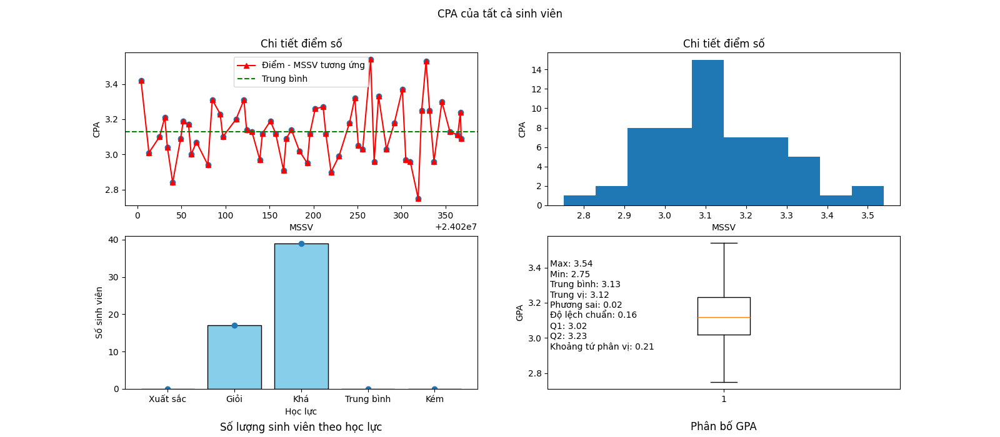
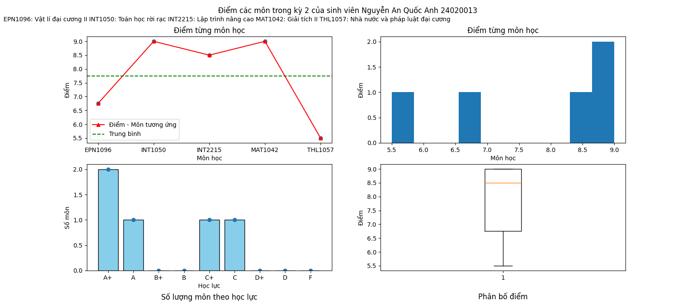
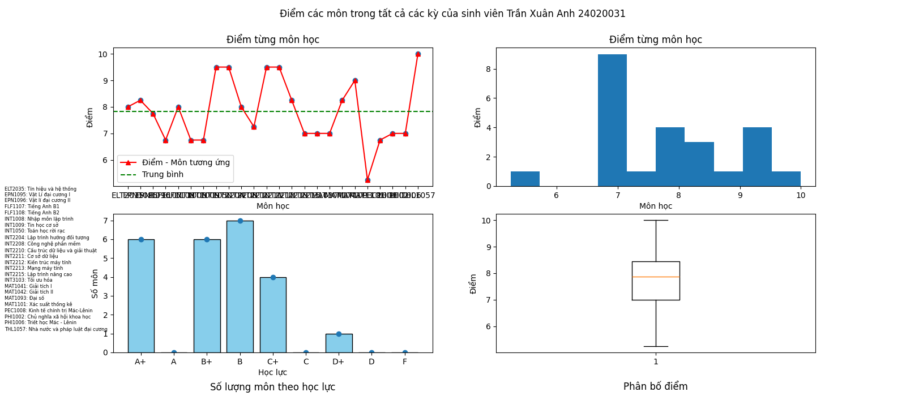
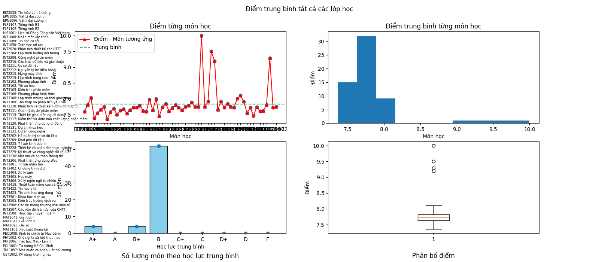
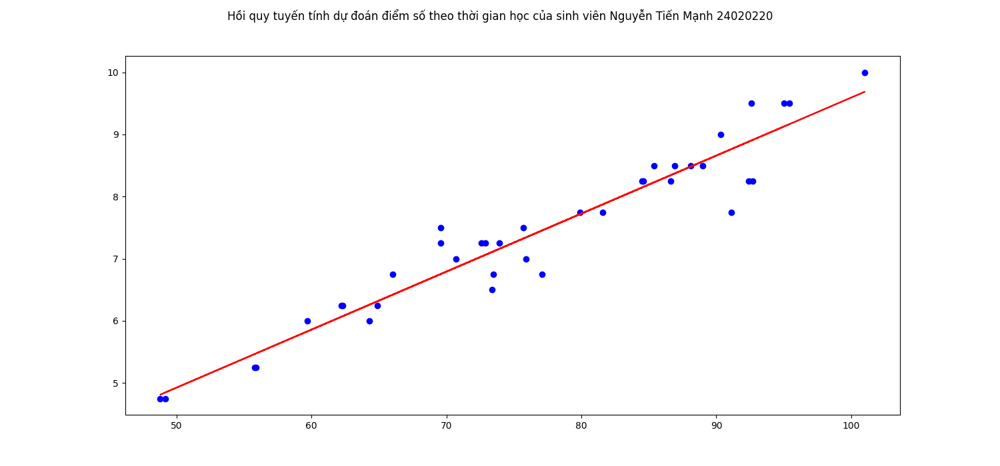
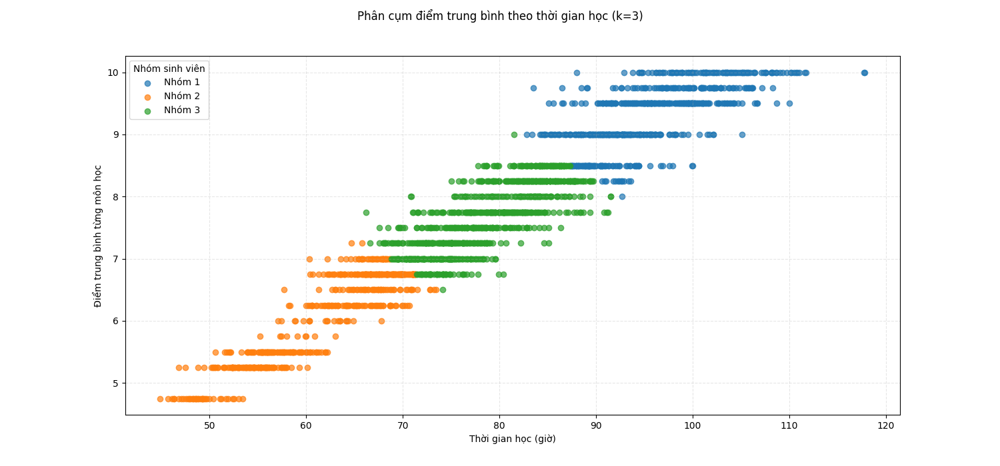
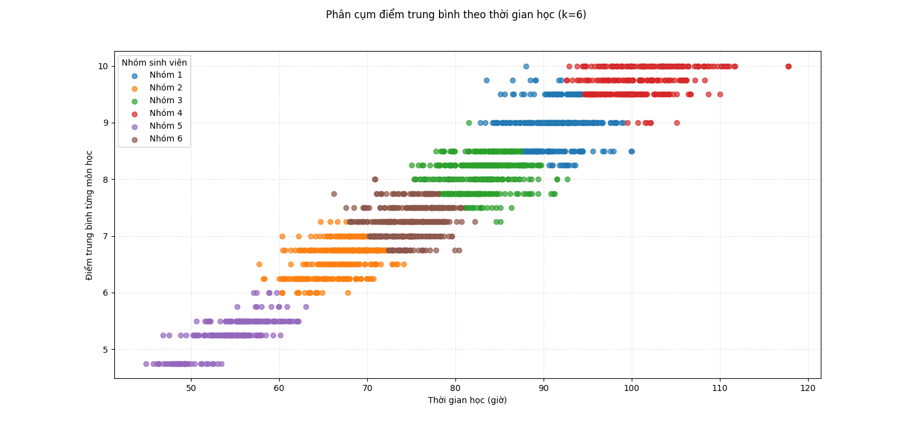

# DỰ ÁN TỰ HỌC CÁ NHÂN: THỐNG KÊ VÀ PHÂN TÍCH ĐIỂM SINH VIÊN 
- (Đang phát triển)
- Đang chuyển giao diện sang TUI
## Mục lục
- [Mục đích](#mục-đích)
- [Dữ liệu](#kiến-thức)
- [Dữ liệu](#dữ-liệu)
- [Chức năng cơ bản](#chức-năng-cơ-bản)
- [Chức năng nâng cao](#chức-năng-nâng-cao)
- [Giấy phép](#giấy-phép)
- [Liên hệ](#liên-hệ)
## Mục đích
- Tự học python, lập dự án với python
- Học và thực hành các thư viện phổ biến: Numpy, Matplotlib, pandas
- Học cách thống kê và phân tích dữ liệu cơ bản
- Học một số các kỹ thuật nâng cao: Hồi quy, Phân cụm K-Means để đánh giá sinh viên
- Bắt đầu làm quen OpenCV -> Xử lý ảnh nếu yêu cầu thay đổi thông tin sinh viên là ảnh thay vì phải nhập excel
## Kiến thức
- Toán học cơ bản: Thống kê, Tính toán
- Học máy cơ bản: Các mô hình hồi quy, Phân cụm K-Means
- Thị giác máy tính: Xử lý ảnh
## Dữ liệu
- Cơ sở dữ liệu:
    - Bảng Sinh viên:
        - Mã số sinh viên: Lấy chính xác từ danh sách K69I-IT4 của UET
        - Họ và tên: Lấy chính xác từ danh sách K69I-IT4 của UET
        - Khóa chính: Mã số sinh viên
    - Bảng Lớp học:
        - Mã lớp học: Lấy chính xác mã của học phần chương trình đào tạo
        - Học Kỳ: Có 4 kì (12425, 22425, 12526, 22526)
        - Tên lớp học: Lấy chính xác tên của học phần chương trình đào tạo
        - Khóa chính: Mã lớp học + Học kỳ
    - Bảng điểm lớp học:
        - Mã lớp học: Như trên
        - Học Kỳ: Như trên
        - Mã số sinh viên: Như trên
        - Điểm: Vì bảo mật thông tin nên điểm số của tất cả sinh viên lấy ngẫu nhiên theo thuật toán tự bản thân đặt ra, không phải điểm thật của sinh viên
        - Khóa chính: Mã lớp học + Học kỳ + Mã số sinh viên
    - Bảng thời gian học:
        - Mã lớp học: Như trên
        - Mã số sinh viên: Như trên
        - Thời gian học: Random theo quy tắc tự đặt
        - Khóa chính: Mã lớp học + Mã số sinh viên
## Chức năng cơ bản
#### Một số hàm cần thiết khi sử dụng
- Chú ý: 
    - Các hàm đã tự động truy cập database, người dùng không cần truy cập lại. 
    - Không có hàm nào in ra màn hình vì mục đích vẽ biểu đồ, nếu muốn đơn lẻ hiện ra màn hình thì thêm print.
1. get_cpa_10(MSSV) và get_cpa_4(MSSV): Lấy CPA hệ 10 và hệ 4 của 1 sinh viên
2. get_arr_cpa_10(MSSV) và get_arr_cpa_4(MSSV): Lấy danh sách điểm trung bình từng môn tất cả các kỳ của 1 sinh viên theo hệ 10 và hệ 4
3. get_name_student(MSSV): Lấy tên sinh viên 
4. get_gpa_10(MSSV, HocKy) và get_gpa_4(MSSV, HocKy): Lấy GPA hệ 10 và hệ 4 của 1 Học kỳ
5. get_arr_gpa_10(MSSV, HocKy) và get_arr_gpa_4(MSSV, HocKy): Lấy điểm trung bình từng môn hệ 10 và hệ 4 của 1 Học kỳ
6. get_info_sinhvien(MSSV): Trả về tất cả thông tin và bảng điểm của sinh viên
7. change_score_to_4(score) và change_score_to_word(score): Chuyển điểm thành hệ 4 và hệ chữ
8. evaluate_academic_perfomance(MSSV, HocKy=None): Đánh giá học lực, mặc định là đánh giá tất cả kỳ nếu không truyền HocKy
9. evaluate_student(MSSV, HocKy=None): Đánh giá tất cả thông tin của 1 sinh viên
10. get_all_MSSV() - get_all_MLH() - get_all_MLH_by_MSSV(MSSV): Trả về danh sách tất cả MSSV, Trả về danh sách tất cả mã lớp học MLH, Trả về danh sách tất cả mã lớp mà sinh viên có mã số MSSV theo học
11. get_all_score_in_a_LopHoc(MLH): Trả về danh sách điểm của tất cả sinh viên trong lớp học đó
12. get_time_of_a_Lophoc_by_MSSV(MLH, MSSV): Trả về thời gian học môn đó của 1 sinh viên
#### GPA của 1 sinh viên trong tất cả các kỳ  
- Hướng dẫn vẽ: Sử dụng hàm sau:  
    draw_chart_each_gpa_of_a_student(MSSV)  
    - MSSV: Mã số sinh viên  

#### GPA của cả lớp trong 1 kỳ  
- Hướng dẫn vẽ: Sử dụng hàm sau:  
    draw_chart_gpa_of_all_students_a_HocKy(HocKy)  
    - HocKy: Học kỳ. Có các kỳ như sau: 1, 2, 3, 4, 5, 6, 7 

#### CPA của cả lớp  
- Hướng dẫn vẽ: Sử dụng hàm sau:
    draw_chart_gpa_of_all_students_a_HocKy(HocKy)  
    - HocKy Học kỳ. Có các học kỳ: 1, 2, 3, 4, 5, 6, 7

#### Thống kê dữ liệu điểm của 1 môn học  
- Hướng dẫn vẽ: Sử dụng hàm sau:
    draw_chart_scores_all_students_in_a_LopHoc(MLH)  
    - MLH là mã lớp học  
  

#### Thống kê điểm từng môn trong 1 kỳ của 1 sinh viên  
- Hướng dẫn vẽ: Sử dụng hàm sau:
    draw_chart_scores_all_subjects_of_a_student_in_a_HocKy(MSSV, HocKy)  
    - MSSV: Mã số sinh viên  
    - HocKy: Học kỳ  
  

#### Thống kê điểm tất cả các môn trong tất cả kì của sinh viên
- Hướng dẫn vẽ: Sử dụng hàm sau:
    draw_chart_scores_all_subjects_of_a_student_in_all_HocKy(MSSV)  
    - MSSV: Mã số sinh viên
    - Vì số lượng môn rất nhiều nên là giá trị cột x bị chèn nhau, bạn có thể trỏ chuột vào các điểm, nó sẽ tự động hiện ra thông tin chi tiết.   
  

#### Thống kê điểm trung bình của tất cả các môn học với nhau
- Hướng dẫn vẽ: Sử dụng hàm sau:
    - draw_chart_scores_all_LopHoc()
    - Vì số lượng môn rất nhiều nên là giá trị cột x bị chèn nhau, bạn có thể trỏ chuột vào các điểm, nó sẽ tự động hiện ra thông tin chi tiết.  
  

## Chức năng nâng cao
#### Hồi quy  
  

#### Phân cụm
- Phân thành k cụm, mặc định là 3
- Hướng dẫn vẽ: Sử dụng hàm sau:
    draw_chart_k_means(k)   
    - Với k là số cụm  
  
  

#### Dự đoán khả năng làm Khóa luận / Đồ án tốt nghiệp của từng sinh viên
- Đặt vấn đề: Từ khả năng học như thế, các sinh viên sẽ làm Khóa luận / Đồ án tốt nghiệp như nào. Có thể dự đoán được chất lượng, cũng như là số điểm theo thời gian họ bỏ ra để hoàn thành hay không?
- Yêu cầu: Có MSSV, người dùng nhập thời gian mà sinh viên đó làm làm Khóa luận / Đồ án vào để dự đoán điểm đạt được nếu như bỏ ra thời gian như trên
#### Nhập và thay đổi thông tin sinh viên từ ảnh
#### Phân tích khả năng sinh viên thông qua ảnh đồ thị học tập
## Giấy phép
- Dự án này chỉ dùng để học tập
## Liên hệ
- Email: manilife217@gmail.com
##### Last update: 22/01/2026