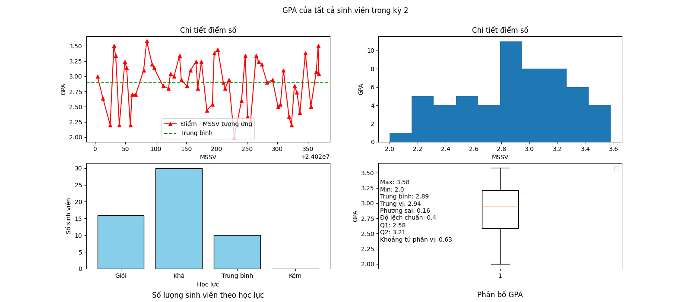
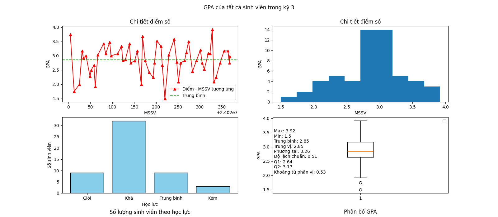
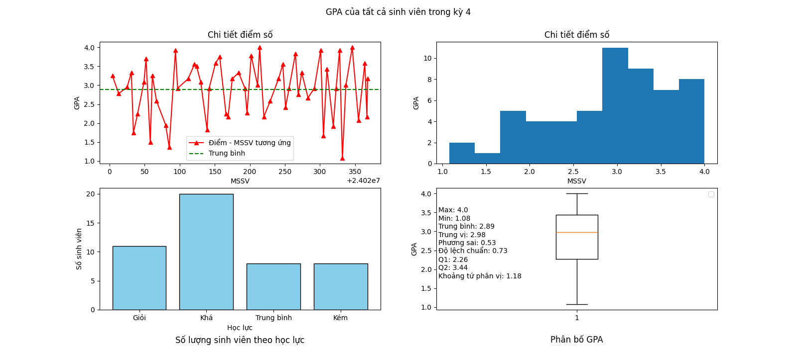

#
## Mục đích
## Dữ liệu
- Cơ sở dữ liệu:
    - Bảng Sinh viên:
        - Mã số sinh viên: Lấy chính xác từ danh sách K69I-IT4 của UET
        - Họ và tên: Lấy chính xác từ danh sách K69I-IT4 của UET
        - Khóa chính: Mã số sinh viên
    - Bảng Lớp học:
        - Mã lớp học: Lấy chính xác mã của học phần chương trình đào tạo
        - Học Kỳ: Có 4 kì (12425, 22425, 12526, 22526)
        - Tên lớp học: Lấy chính xác tên của học phần chương trình đào tạo
        - Khóa chính: Mã lớp học + Học kỳ
    - Bảng điểm lớp học:
        - Mã lớp học: Như trên
        - Học Kỳ: Như trên
        - Mã số sinh viên: Như trên
        - Điểm: Vì bảo mật thông tin nên điểm số của tất cả sinh viên lấy ngẫu nhiên theo thuật toán tự bản thân đặt ra, không phải điểm thật của sinh viên
        - Khóa chính: Mã lớp học + Học kỳ + Mã số sinh viên
## Chức năng cơ bản
#### GPA của 1 sinh viên trong tất cả các kỳ  
- Hướng dẫn vẽ: Sử dụng hàm sau trong main:
    draw_chart_each_gpa_of_a_student(MSSV)  
    - MSSV: Điền MSSV của từng sinh viên, muốn biết chi tiết thì dùng hàm 
    print(get_all_mssv()) sẽ in ra tất cả MSSV của sinh viên trong danh sách  

#### GPA của cả lớp trong 1 kỳ  
- Hướng dẫn vẽ: Sử dụng hàm sau trong main:
    draw_chart_gpa_of_all_students_a_HocKy(HocKy)  
    - HocKy: Có 4 kỳ như sau: 12425, 22425, 12526, 22526  
  
  
  
  
#### CPA của cả lớp  
#### Thống kê dữ liệu điểm của 1 môn học  
#### Thống kê điểm từng môn trong 1 kỳ của 1 sinh viên
#### Thống kê điểm tất cả các môn trong tất cả kì của sinh viên
#### Thống kê điểm trung bình của tất cả các môn học với nhau