# DỰ ÁN TỰ HỌC CÁ NHÂN: THỐNG KÊ VÀ PHÂN TÍCH ĐIỂM SINH VIÊN 
- (Đang phát triển)
## Mục lục
- [Mục đích](#mục-đích)
- [Kiến thức](#kiến-thức)
- [Cách cài đặt](#cách-cài-đặt)
- [Yêu cầu](#yêu-cầu)
- [Cấu trúc thư mục](#cấu-trúc-thư-mục)
- [Hình thức sử dụng](#hình-thức-sử-dụng)
- [Công nghệ sử dụng](#công-nghệ-sử-dụng)
- [Thiết kế](#thiết-kế)
- [Dữ liệu + Tạo dữ liệu](#dữ-liệu--tạo-dữ-liệu)
- [Chức năng + Xem trước chức năng](#chức-năng--xem-trước-chức-năng)
- [Giấy phép](#giấy-phép)
- [Liên hệ](#liên-hệ)
## Mục đích
- Tự học python, lập dự án với python, kết hợp các kiến thức tự học để làm dự án
- Học và thực hành các thư viện phổ biến: Numpy, Matplotlib, pandas, scikit-learn, scipy, OpenCV
- Học cách thống kê và phân tích dữ liệu cơ bản
- Học một số các kỹ thuật cơ bản: Hồi quy tuyến tính, Phân cụm K-Means
- Bắt đầu làm quen Xử lý ảnh
## Kiến thức
- Toán học cơ bản: Thống kê, Tính toán
- Học máy cơ bản: Hồi quy, Phân cụm K-Means
- Thị giác máy tính: Xử lý ảnh
## Cách cài đặt
    (Không phụ thuộc IDE, có thể dùng luôn cmd cho tiện)
    1. Sao chép dự án
        git clone https://github.com/TienManh-Manilife/Student_Score_Analyzer
    2. Cài môi trường ảo
        python -m venv venv
    3. Mở môi trường ảo
        Window: venv\Scripts\activate
        Linux/MacOs: source venv/bin/activate
    4. Tải thư viện cần thiết
        pip install -r requirements.txt (Sau khi cài và mở venv)
    5. Chạy chương trình
        python main.py
## Yêu cầu
Khuyến nghị các phiên bản python 3.10, 3.11, 3.12. không nên dùng các phiên bản 3.14
## Cấu trúc thư mục
... Cập nhật sau
## Hình thức sử dụng
- Người dùng làm việc thông qua giao diện TUI (Text-based User Interface): 
    - Tương tác chuột
    - Nhập thông tin
## Công nghệ sử dụng
- Ngôn ngữ: Python
- CSDL: SQLite
- Thư viện:
  - numpy, pandas
  - matplotlib
  - scikit-learn
  - scipy
  - OpenCV
  - textual (TUI)
- Công cụ: VSCode
## Thiết kế
Tách riêng các phần đảm bảo dễ mở rộng hơn trong tương lai:
- resources: Chứa dữ liệu + Các hình ảnh xem trước
- libs: Chứa các hàm thực hiện hành động với dữ liệu đã có bên trên: CSDL, phân cụm, hồi quy, vẽ biểu đồ
- tui: Chứa mã thiết kế giao diện thành 1 thể thống nhất: Ứng dụng + Màn hình (Các màn hình có cấu trúc kế thừa từ cùng 1 màn hình cơ sở)
## Dữ liệu + Tạo dữ liệu
- Cơ sở dữ liệu:
    - Bảng Sinh viên:
        - Mã số sinh viên: Lấy chính xác từ danh sách K69I-IT4 của UET
        - Họ và tên: Lấy chính xác từ danh sách K69I-IT4 của UET
        - Khóa chính: Mã số sinh viên
    - Bảng Lớp học:
        - Mã lớp học: Lấy chính xác mã của học phần chương trình đào tạo
        - Học Kỳ: Có 4 kì (12425, 22425, 12526, 22526)
        - Tên lớp học: Lấy chính xác tên của học phần chương trình đào tạo
        - Khóa chính: Mã lớp học
    - Bảng điểm lớp học:
        - Mã lớp học: Như trên
        - Học Kỳ: Như trên
        - Mã số sinh viên: Như trên
        - Điểm: Không phải điểm thật, random điểm
        - Khóa chính: Mã lớp học + Mã số sinh viên
    - Bảng thời gian học:
        - Mã lớp học: Như trên
        - Mã số sinh viên: Như trên
        - Thời gian học: Điểm càng cao, thời gian học càng nhiều (Thời gian = a.Điểm + b + nhiễu) Với mỗi điểm, a = random.gauss(10, 0.5) và b = random.gauss(2, 0.5) và nhiễu = random.gauss(0, 0.2)
        - Khóa chính: Mã lớp học + Mã số sinh viên
## Chức năng + Xem trước chức năng
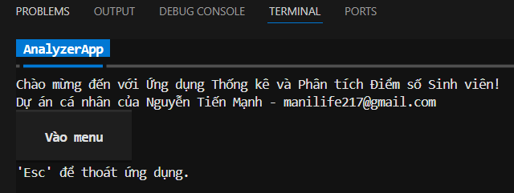
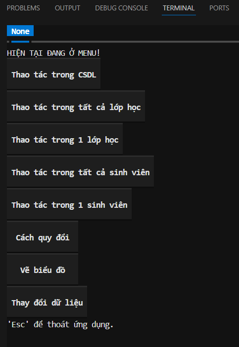

### Thao tác trong cơ sở dữ liệu
    1. Tạo tất cả bảng trong CSDL
    2. Chèn dữ liệu từ xlsx vào tất cả bảng
    3. Xóa tất cả bảng trong CSDL
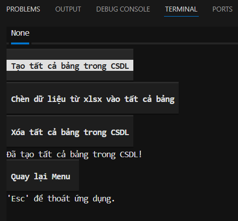

### Thao tác trong tất cả lớp học
    1. Hiện tất cả mã lớp học
    2. Hiện tất cả mã lớp học trong 1 học kỳ
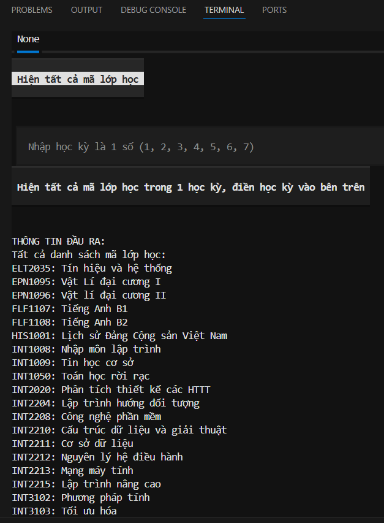

### Thao tác trong 1 lớp học
    1. Hiện tên lớp học
    2. Hiện điểm trung bình các sinh viên trong 1 lớp
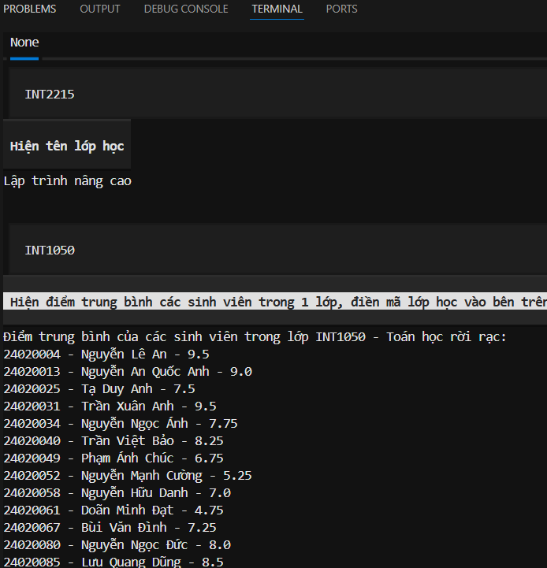

### Thao tác trong tất cả sinh viên
    1. Hiện thông tin tất cả sinh viên
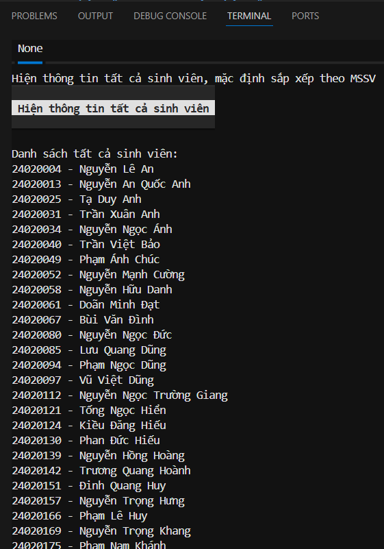

### Thao tác trong 1 sinh viên
    1. Hiện CPA và các lớp học mà sinh viên theo học, điểm từng môn và thời gian học
    2. Hiện GPA và danh sách các môn của 1 học kỳ của 1 sinh viên
    3. Hiện tất cả thông tin trong CSDL của sinh viên dưới dạng các bộ sau khi join
    4. Đánh giá sinh viên theo từng kỳ hoặc toàn bộ tất cả các kỳ. Nếu không nhập học kỳ thì đánh giá toàn bộ tất cả các kỳ
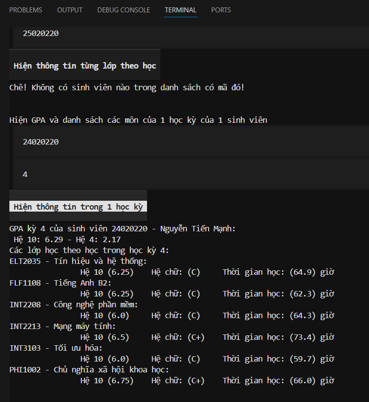

### Cách quy đổi
    Hiện quy đổi các đầu điểm
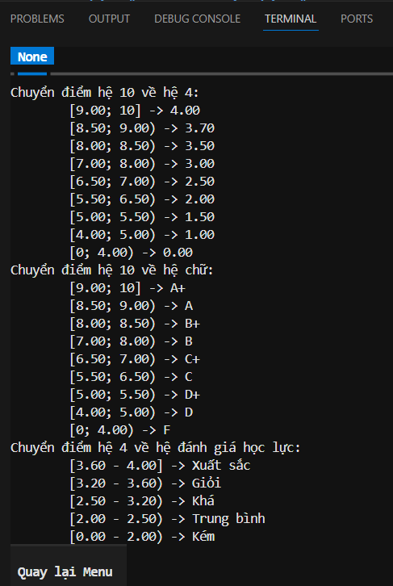

### Vẽ biểu đồ
    <Các chức năng vẽ biểu đồ sẽ tự động lưu ảnh vào <./resources/outputimages/...>
    1. Vẽ biểu đồ thể hiện GPA của sinh viên qua các học kỳ
    2. Vẽ biểu đồ thống kê GPA của tất cả sinh viên trong 1 học kỳ
    3. Vẽ biểu đồ thống kê CPA của tất cả sinh viên
    4. Vẽ biểu đồ thống kê điểm trung bình tất cả sinh viên trong 1 lớp học
    5. Vẽ biểu đồ thống kê điểm tất cả môn học của 1 sinh viên trong 1 học kỳ
    6. Vẽ biểu đồ thống kê điểm tất cả môn học của 1 sinh viên qua tất cả học kỳ
    7. Vẽ biểu đồ thống kê điểm tất cả lớp học
    8. Hồi quy tuyến tính dự đoán điểm số theo thời gian học của sinh viên
    9. Phân cụm K-Means điểm trung bình theo thời gian học của sinh viên
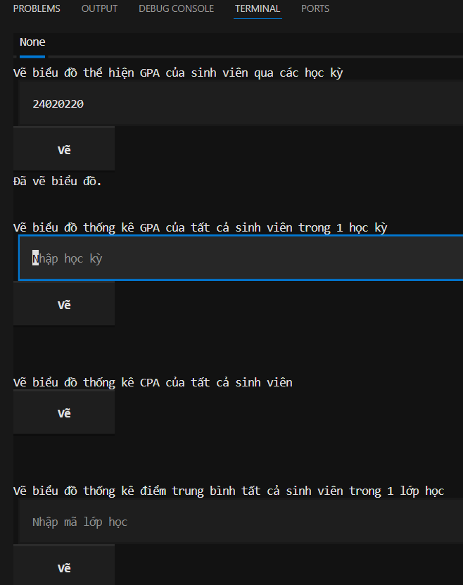 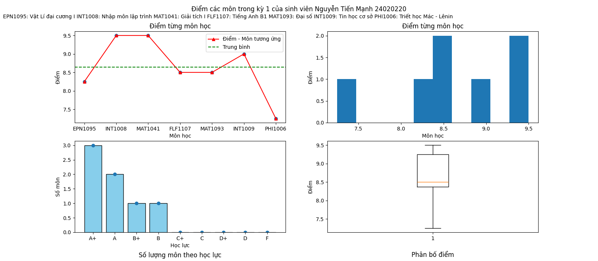  

### Thay đổi dữ liệu
    1. Sửa đổi Họ tên trong bảng SinhVien
    2. Sửa đổi Tên lớp học trong bảng LopHoc
    3. Sửa đổi điểm trong bảng BangDiem
    4. Sửa đổi thời gian học trong bảng ThoiGianHoc
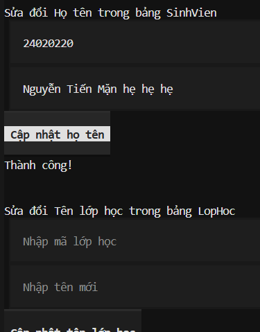

### Dự đoán khả năng làm Khóa luận / Đồ án tốt nghiệp của từng sinh viên
- Đặt vấn đề: Từ khả năng học như thế, các sinh viên sẽ làm Khóa luận / Đồ án tốt nghiệp như nào. Có thể dự đoán được chất lượng, cũng như là số điểm theo thời gian họ bỏ ra để hoàn thành hay không?
- Yêu cầu: Có MSSV, người dùng nhập thời gian mà sinh viên đó làm làm Khóa luận / Đồ án vào để dự đoán điểm đạt được nếu như bỏ ra thời gian như trên
#### Nhập và thay đổi thông tin sinh viên từ ảnh
#### Phân tích khả năng sinh viên thông qua ảnh đồ thị học tập
## Giấy phép
- Dự án này chỉ dùng để học tập
## Liên hệ
Email: manilife217@gmail.com  
Last update: 22/01/2026